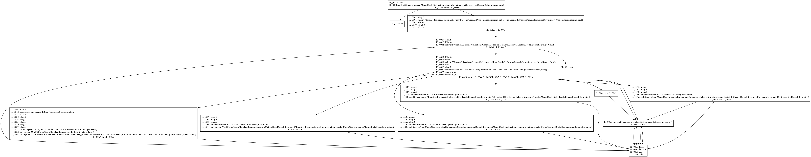

# Control Flow Graph generator

This simple tool generates output in dot lanaguage that represents CFG for a given compiled function. 

**This is a PoC.**

The process works as follows:

1) generate leaders that will indicate the beginning of a basic block (BB)
	- If the instruction's control flow type is of type `Return` - the next one (if exists) will be a leader.
	- If the instruction's control flow type is of type `Branch` - the destination of the branch instruction will be a leader
	- If the instruction's control flow type is of type `Cond_Branch` - the destination of the branch and the next instruction will be leaders.

2) generate edges
	- If the instruction's control flow type is of type `Return` there will be no outgoing edge
	- If the instruction's control flow type is of type `Branch` there will be an outgoing edge from the current instruction's BB to the branch's destination BB
	- If the instruction's control flow type is of type `Cond_Branch` there will be outgoing edges from the current BB to the destination of the `Cond_Branch` BB and to the next instruction's BB

3) print control flow graph in the DOT language

To get the final image, transform the output with `dot` tool.

Example: 
>  `./cfg.exe Mono.Cecil.dll Mono.Cecil.MetadataBuilder.AddCustomDebugInformations | dot -Tpng -o cfg-add-custom-debug-informations.png`

